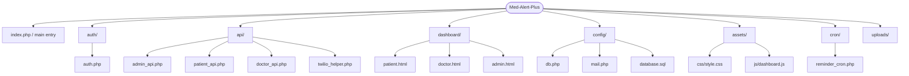
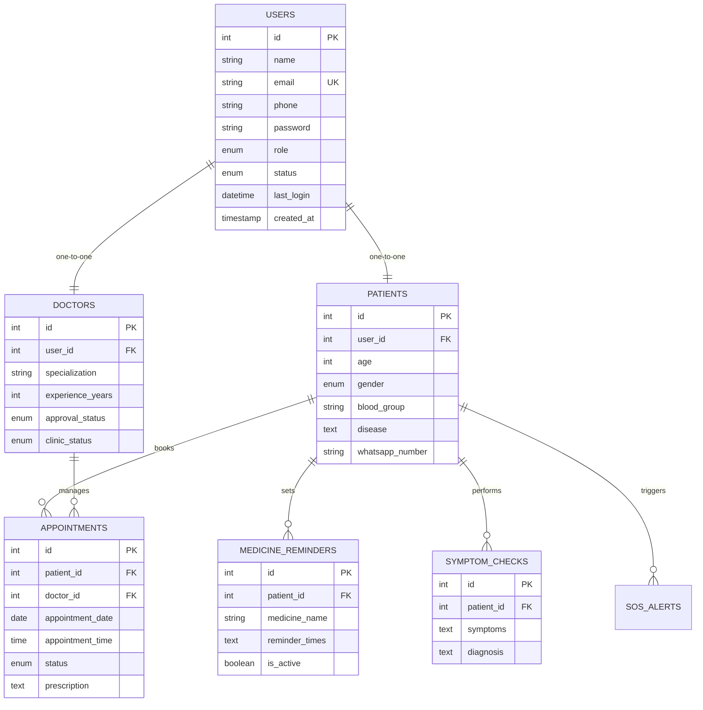

# 🏥 Med-Alert-Plus Project Analysis

This document provides a detailed breakdown of the **Med-Alert-Plus** platform architecture, its database schema, and best practices for deploying it to **InfinityFree**.

---

## 📂 Project Structure Overview

The project follows a standard PHP-based architecture with separated concerns:
- **`auth/`**: Core logic for authentication (Login, Register, OTP).
- **`api/`**: Functional backend logic (Admin, Doctor, Patient specific actions).
- **`config/`**: Global configurations (Database, Mail, API keys).
- **`dashboard/`**: Front-end entry points for different user roles.
- **`assets/`**: Static files (CSS, JS, Images).



---

## 🗄️ Database Schema (ER Diagram)

The database is built on a central `users` table linked to specialized profiles (`patients`, `doctors`) and transactional tables for `appointments` and `medication`.



---

## 🚀 InfinityFree Deployment Guide

InfinityFree is a popular choice for hosting PHP/MySQL projects. To ensure a smooth migration from XAMPP to the cloud, follow these steps:

### 1. Database Configuration
On InfinityFree, the database host is **not `localhost`**. 
> [!IMPORTANT]
> Update `config/db.php` with the credentials provided in your InfinityFree control panel.

```php
// config/db.php
define('DB_HOST', 'sqlxxx.infinityfree.com'); // Check your control panel
define('DB_USER', 'if0_xxxxxxx');            // Your DB username
define('DB_PASS', 'your_password');          // Your account password
define('DB_NAME', 'if0_xxxxxxx_medalertplus'); // Your DB name
```

### 2. Uploading the SQL Script
1.  Access **phpMyAdmin** from your InfinityFree dashboard.
2.  Import `config/database.sql`.
3.  **Note**: InfinityFree might have restrictions on `CREATE DATABASE` commands. If the import fails, remove the `CREATE DATABASE` line from the `.sql` file and import into the existing database provided by InfinityFree.

### 3. File Permissions
Ensure the `uploads/` directory and its subdirectories have write permissions (**CHMOD 755 or 777**). This is required for patient report uploads to function.

### 4. Cron Jobs (Medicine Reminders)
InfinityFree's free tier has limited support for true background cron jobs.
- **Option A**: Use an external service like **Cron-job.org** to ping your `cron/reminder_cron.php` every minute.
- **Option B**: Ensure that only people with the URL can access it by adding a secret key (security check).

### 5. .htaccess Fix (Optional)
If you're using clean URLs or if your PHP files aren't loading correctly, ensure your `.htaccess` file is present in the root. InfinityFree usually handles this, but it's worth checking if you encounter 404 errors.

---

## 🎯 Key Recommendations
- **Security**: Replace the hardcoded `ANTHROPIC_API_KEY` and `TWILIO` tokens in `config/db.php` with actual production keys.
- **SSL**: InfinityFree provides free SSL via their dashboard. Ensure you enable it and force HTTPS redirection in `.htaccess`.
- **Email**: Since InfinityFree restricts the standard PHP `mail()` function, using **PHPMailer** as you've already implemented is the correct approach. Ensure you use an external SMTP provider like Gmail or SendGrid.
